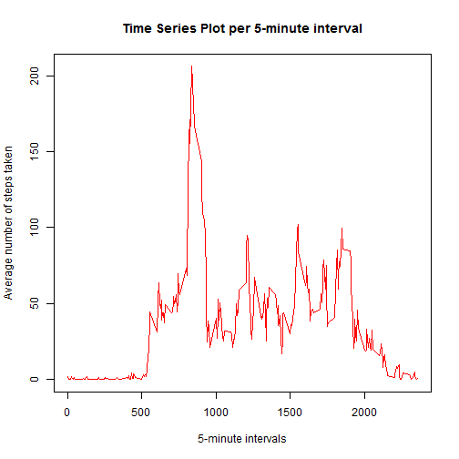
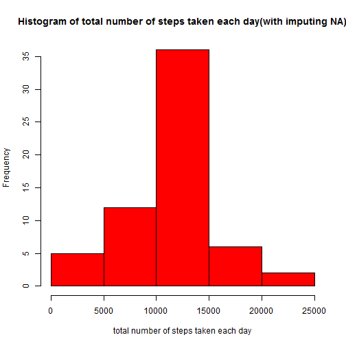

# Reproducible Research: Peer Assessment 1
========================================================
Created by LJ-Lincoln


## Loading and preprocessing the data
-------------------------

### Loading the data

```r
data=read.csv("activity.csv")
```
### Preprocessing

```r
#  Total steps per day
newdata.day=aggregate(steps~date,data=data,sum)
#  Total steps per interval
newdata.interval=aggregate(steps~interval,data=data,sum,na.rm=TRUE)
#  Mean steps per interval
newdata.meanStep.Interval=aggregate(steps~interval,data=data,mean,na.rm=TRUE)
```

## What is mean total number of steps taken per day?
-------------------------
### Histogram of total number of steps taken per day

```r
hist(newdata.day$steps,col="red",xlab="total number of steps taken each day",main="Histogram of total number of steps taken each day")
```

 
### The mean and median total number of steps taken per day

Mean number of steps per day:

```r
mean(newdata.day$steps)
```

```
## [1] 10766
```
Median number of steps per day:

```r
median(newdata.day$steps)
```

```
## [1] 10765
```

## What is the average daily activity pattern?
-------------------------

### Time series plot


```r
plot(newdata.meanStep.Interval$interval, newdata.meanStep.Interval$steps, type="n", 
     main="Time Series Plot per 5-minute interval",
     xlab = "5-minute intervals",
     ylab = "Average number of steps taken") 
lines(newdata.meanStep.Interval$interval, newdata.meanStep.Interval$steps,col="red",type="l") 
```

 

### Maximum number of steps


Maximum number of steps:

```r
newdata.meanStep.Interval[which.max(newdata.meanStep.Interval$steps),1]
```

```
## [1] 835
```

## Inputing missing values
-------------------------

### Total number of missing values

```r
sum(is.na(data$steps))
```

```
## [1] 2304
```

### Filling in missing values
*I use the mean step of each inerval to fill in the missing values.*

```r
data.merge=merge(data,newdata.meanStep.Interval,by="interval")
data.merge$steps.x[is.na(data.merge$steps.x)]=data.merge$steps.y[is.na(data.merge$steps.x)]
```

### Creating a new dataset

```r
clean.data=data.merge[,c(2,3,1)]
clean.data=clean.data[with(clean.data, order(date)), ]
```

### About the new dataset
_Preprocessing the new data_

```r
clean.data.day=aggregate(steps.x~date,data=clean.data,sum)
```
_Histogram of total number of steps taken per day_

```r
hist(clean.data.day$steps.x,col="red",xlab="total number of steps taken each day",main="Histogram of total number of steps taken each day(with imputing NA)")
```

 

_The mean and median total number of steps taken per day_

Mean number of steps per day(with imputing NA):

```r
mean(clean.data.day$steps.x)
```

```
## [1] 10766
```
Median number of steps per day(with imputing NA):  

```r
median(clean.data.day$steps.x)
```

```
## [1] 10766
```
*The mean are the same.*  

*The median are almost the same.*

## Are there differences in activity patterns between weekdays and weekends?
---------------------------------------------------------------------------
### new factor variable

```r
clean.data.2=clean.data
clean.data.2$wdays=factor(ifelse(as.POSIXlt(as.Date(clean.data$date))$wday%%6==0, "weekend", "weekday"))
```

### panel plot

```r
#  Mean steps per interval
clean.data.meanStep.Interval=aggregate(clean.data.2$steps.x,by=list(clean.data.2$wdays,clean.data.2$interval),mean,na.rm=TRUE)
names(clean.data.meanStep.Interval)=c("wdays","interval","mean.steps")

# plot
library(lattice)
xyplot(clean.data.meanStep.Interval$mean.steps ~ clean.data.meanStep.Interval$interval | 
    clean.data.meanStep.Interval$wdays, layout = c(1, 2), type = "l", xlab = "Interval", 
    ylab = "Number of steps")
```

 

